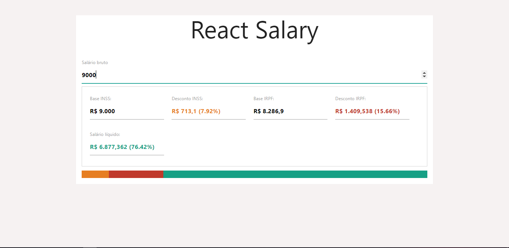

## React Salary

## O que a aplicação faz?
Aplicação faz o calculo do discounto do INSS e do IRPF dependendo do salário.

## O que a aplicação não faz?
Ela não calculo o desconto se você tiver algum dependente.

## Para rodar aplicação:
* Digite no terminal __yarn install__
* Digite no terminal __yarn start__

